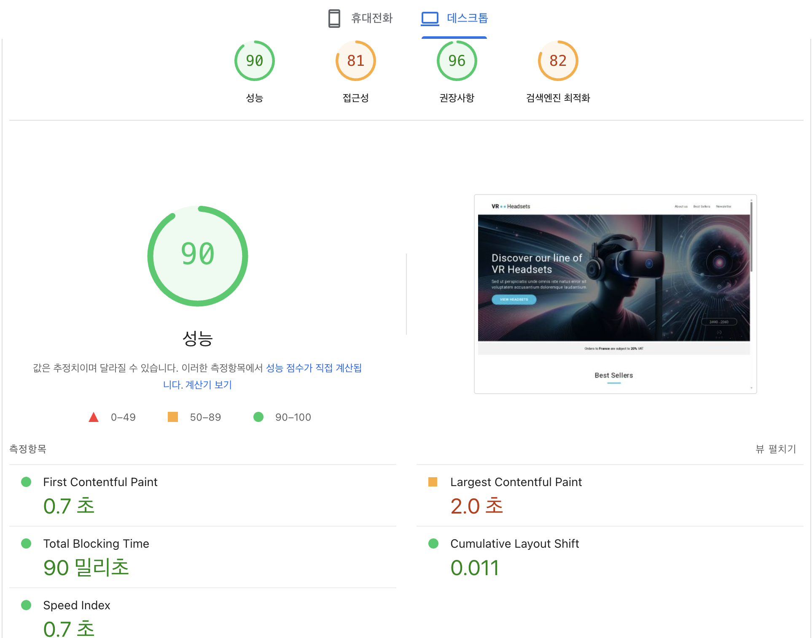
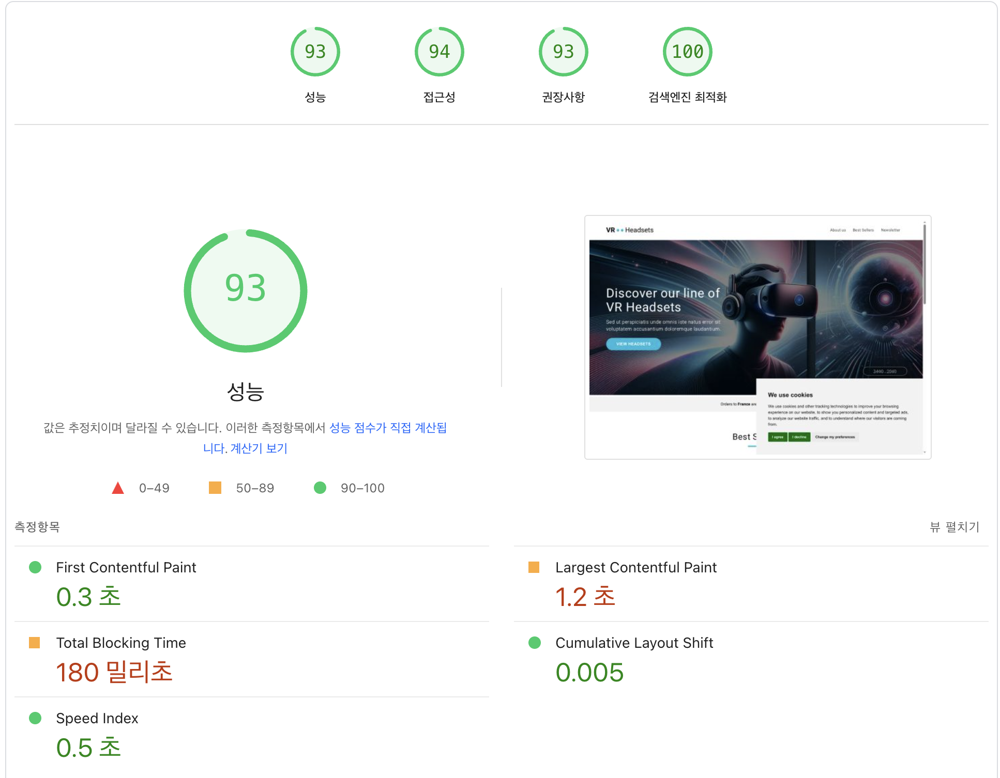

# 바닐라 JS 프로젝트 성능 개선

-   url: https://hanghae-chapter-4-2.firebaseapp.com/

## 성능 개선 보고서

### 개선 이유

#### 1. 이미지 최적화 필요성

-   JPG 형식의 이미지를 최신 WebP 포맷으로 변환 필요
-   디바이스 크기별 최적화된 이미지 제공 필요
-   Picture 태그를 통한 반응형 이미지 지원 필요
-   뷰포트 밖 이미지의 지연 로딩 적용 필요

#### 2. JavaScript 실행 최적화 필요

-   쿠키 동의 스크립트의 비동기 로딩 필요
-   DOM 로드 완료 후 스크립트 실행 필요
-   스크립트 실행 순서 최적화 필요
-   불필요한 초기 로딩 차단 방지 필요

#### 3. 웹 폰트 최적화 필요

-   폰트 로딩 중 FOUT/FOIT 현상 개선 필요
-   폰트 파일의 preload 전략 적용 필요
-   폰트 스왑 전략 최적화 필요

#### 4. 리소스 로딩 전략 개선 필요

-   주요 리소스의 우선순위 지정 필요
-   초기 렌더링에 필요한 리소스 최적화 필요
-   리소스 요청의 효율적 관리 필요

 

### 개선 방법

#### 1. 이미지 크기 및 포맷 최적화

-   모든 주요 이미지를 최신 WebP 포맷으로 변환하여 이미지 용량을 대폭 감소시켰습니다
-   디바이스 화면 크기에 따라 최적화된 이미지를 제공하도록 반응형 이미지 시스템을 구축했습니다
-   히어로 섹션의 이미지에 높은 우선순위를 부여하여 초기 로딩 속도를 개선했습니다
-   각 이미지에 적절한 대체 텍스트를 추가하여 웹 접근성도 함께 향상시켰습니다

#### 2. 지연 로딩(Lazy Loading) 적용

-   스크롤이 필요한 영역의 이미지들에 지연 로딩을 적용하여 초기 페이지 로드 시간을 단축했습니다
-   제품 이미지들의 크기를 미리 지정하여 이미지 로드 시 레이아웃 변화를 방지했습니다
-   사용자의 뷰포트에 들어올 때만 이미지를 로드하도록 하여 불필요한 데이터 사용을 줄였습니다
-   중요하지 않은 이미지의 디코딩을 비동기로 처리하여 전반적인 성능을 개선했습니다

#### 3. JavaScript 실행 최적화

-   외부 스크립트들의 로딩 방식을 비동기로 변경하여 페이지 렌더링 차단을 방지했습니다
-   쿠키 관련 스크립트의 실행 시점을 DOM 로드 이후로 조정하여 초기 로딩 속도를 개선했습니다
-   스크립트 실행 우선순위를 조정하여 중요한 기능이 먼저 작동하도록 최적화했습니다
-   불필요한 스크립트 실행을 지연시켜 전반적인 페이지 성능을 향상시켰습니다

#### 4. 웹 폰트 최적화

-   구글 폰트 로딩 전략을 개선하여 텍스트가 즉시 표시되도록 구현했습니다
-   폰트 파일을 미리 로드하여 폰트 교체 시 발생하는 깜빡임 현상을 최소화했습니다
-   시스템 폰트를 백업으로 지정하여 웹 폰트 로딩 실패 시에도 적절한 폰트가 표시되도록 했습니다
-   필요한 폰트 웨이트만 선택적으로 로드하여 불필요한 리소스 다운로드를 방지했습니다

### 개선 지표

| 개선 전                         | 개선 후                        |
| ------------------------------- | ------------------------------ |
|  |  |

| 대상                          | 개선 전 | 개선 후 |
| ----------------------------- | ------- | ------- |
| 성능                          | 90      | 93      |
| 접근성                        | 81      | 94      |
| 권장사항                      | 96      | 93      |
| 검색엔진 최적화               | 82      | 100     |
| First Contentful Paint(FCP)   | 0.7초   | 0.3초   |
| Largest Contentful Paint(LCP) | 2.0초   | 1.2초   |
| Total Blocking Time(TBP)      | 0.90초  | 1.80초  |
| Cumulative Layout Shift(CLS)  | 0.011   | 0.005   |
| Speed Index                   | 0.7초   | 0.5초   |
